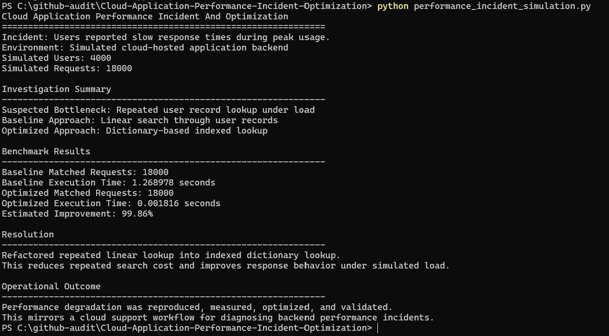

# Cloud Application Performance Incident And Optimization

## Overview

This project simulates a cloud support scenario focused on diagnosing and resolving application performance degradation in a production-like environment.

It demonstrates how inefficient processing logic can impact system response times and how structured investigation and optimization can restore performance.

The project is positioned as an entry-level cloud support and backend performance troubleshooting simulation, showing how technical investigation, benchmarking, and optimization connect to real operational support work.

---

## Simulated Environment

- Cloud-Hosted Application Handling User Requests
- Backend Processing Layer Executing Data Operations
- Increased Request Load Causing Performance Degradation
- Support Engineer Investigating Slow Response Times
- Baseline And Optimized Processing Approaches Compared Through Timing Results

---

## Incident Scenario

Users reported slow system response times during peak usage.

As part of cloud support operations, the objective was to:

- Investigate The Root Cause Of Performance Degradation
- Analyze System Behavior Under Load
- Identify Inefficient Processing Logic
- Implement Optimizations To Restore Performance
- Validate Improvements Through Measured Execution Time

---

## Investigation Process

- Measured Execution Time Of Critical Operations
- Simulated Increased Request Load To Reproduce The Issue
- Identified Bottlenecks In Repeated Data Lookup Logic
- Compared Baseline Versus Optimized Approaches
- Verified The Impact Of Improved Data Structures

---

## Resolution

- Refactored Inefficient Lookup Logic Into Optimized Structures
- Reduced Time Complexity Of Core Operations
- Improved Handling Of Repeated Data Lookups
- Validated Performance Improvements Through Benchmark Testing
- Produced Console Output That Summarizes Baseline And Optimized Results

---

## Outcome

- Reduced Response Time Under Simulated Load
- Improved Processing Efficiency And Scalability
- Established A Repeatable Performance Troubleshooting Workflow
- Demonstrated How Data Structure Choice Impacts Application Performance

---

## System Architecture

```text
Request Layer
        |
        v
Simulated User Traffic
        |
        v
Processing Layer
        |
        v
Core Lookup And Data Processing Logic
        |
        v
Optimization Layer
        |
        v
Improved Data Structures And Reduced Lookup Cost
        |
        v
Measurement Layer
        |
        v
Execution Timing, Comparison, And Performance Summary
```

This layered structure reflects how cloud support teams investigate performance issues by separating request behavior, processing logic, optimization work, and measurement output.

---

## Example Use Case

During peak traffic simulation, response time degraded because the backend repeatedly searched through user records using inefficient linear lookup logic.

By replacing repeated linear searches with an indexed dictionary structure, execution time was significantly reduced, restoring system responsiveness under simulated load.

Example investigation flow:

- Incident: Slow Response During Peak Usage
- Suspected Area: Backend Data Lookup Logic
- Baseline Approach: Repeated Linear Search
- Optimized Approach: Dictionary-Based Lookup
- Result: Faster Processing And Improved Scalability

---

## Performance Simulation Script

The main upgrade file is:

```text
performance_incident_simulation.py
```

It simulates a performance incident by comparing:

- Baseline Processing: Repeated linear search through user records
- Optimized Processing: Pre-indexed dictionary lookup
- Measurement Output: Execution time, result count, and improvement percentage

---

## Technologies Used

- Python
- Data Structures And Algorithm Optimization
- Execution Time Measurement
- Performance Benchmarking
- Cloud Support Incident Simulation

---

## How To Run

From the project root:

```powershell
python performance_incident_simulation.py
```

You can also run the existing example scripts:

```powershell
python run_examples.py
```

---

## Existing Algorithm Reference Files

This repository still includes standalone algorithm and data structure examples that support the optimization theme, including:

- Binary Search
- Quick Sort
- Dijkstra's Algorithm
- CPU Scheduling
- Binary Search Trees
- Graph Traversal
- Dynamic Programming
- Linked Lists
- Recursion

These files represent the underlying computer science knowledge used to reason about performance, scalability, and optimization.

---

## Planned Enhancements

- Introduce Real-Time Performance Monitoring
- Simulate Distributed Processing Scenarios
- Add Automated Performance Alerting
- Expand Benchmarking Across Multiple Workloads
- Add CSV Or JSON Performance Report Output
- Add Before And After Dashboard Screenshot
- Simulate CloudWatch-Style Latency Metrics

---

## Real-World Relevance

This project reflects key cloud support responsibilities:

- Diagnosing Performance Issues In Production Systems
- Identifying Bottlenecks Under Load
- Optimizing System Efficiency
- Measuring Before And After Performance
- Ensuring Scalability And Reliability
- Explaining Technical Findings Clearly

---

## Professional Positioning

This project is designed to represent an entry-level cloud application performance investigation and optimization workflow.

It shows the ability to identify slow processing behavior, measure execution time, apply data structure improvements, and communicate the performance impact clearly.

---

## Dashboard Preview

The screenshot below shows the performance incident simulation running in the terminal, including baseline timing, optimized timing, improvement percentage, resolution, and operational outcome.



